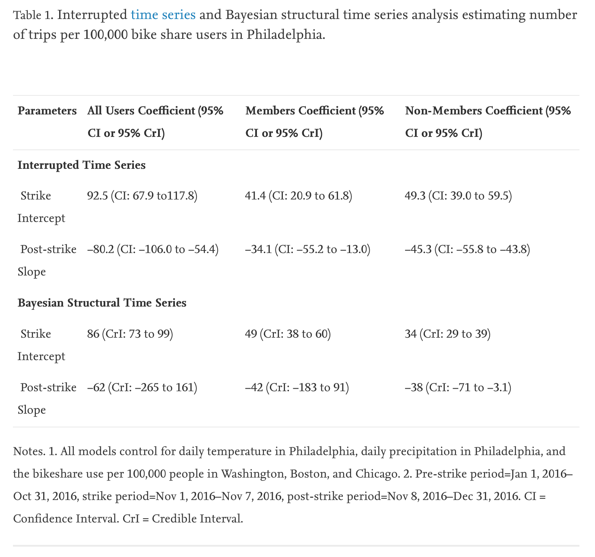

```{r setup, include=FALSE}
knitr::opts_chunk$set(echo = TRUE)

library(tidyverse)
library(readr)
library(gt)
library(gtsummary)

bikeshare <- read_csv("bikeshare.csv")
philly_temperature <- read_csv("philly_temperature.csv")
member_data <- read_csv("member_data.csv")
```

## Drake Deuel

### 3/29/20

My replication paper is **Impact of a public transit strike on public bicycle share use: An interrupted time series natural experiment study** by @FULLER2019. This paper was published in the June 2019 volume of the Journal of Transport & Health. The data was publicly availible to me on Harvard Dataverse @DVN. Given that bikeshare schemes are a relatively new phenomenon, there aren't a huge number of papers looking into their effects, but all papers on the topic are relatively recent such as @BAUMAN.

This paper uses Philadelphia's transit workers strike from November 1-7th, 2016, to generate a natural experiment in which other means of transit are interrupted to study the impact on bikeshare ride usage. The statistical technique used is a Bayesian structural time-series model. The authors cited a seperate paper detailing this modeling method and its efficacy @brodersen. That paper found the Bayesian structural time-series model to be useful in inferring causal impact, so assuming the authors applied the technique correctly it seems to be an accepted method. 

The authors looked at control cities in Washington DC, Boston, and Chicago which are similar to Philidelphia in their size and in the development of their bikeshare infrastructure. They also attempted to control for the temperature and precipitation levels as variables that would also affect bikeshare ride usage. The study found that bikeshare usage went up in Philadelphia during this transit strike when other options were limited, but that after the strike bikeshare usage returned to the pre-strike baseline. The authors concluded that while interventions directed to incentivize bikeshare usage would likely work given the flexibility shown by Philidelphia commuters, these interventions would need to be long term in order to change commuter's habits. 

The authors of this paper produced another paper in 2012 using similar methods to investigate a transit strike in London and the resulting effect on bikeshare use in that case @FULLER2012. That 2012 paper found an increase use of bikeshare programs during the strike, with similar conlclusions to my replication paper.

All analysis for this paper is available on my Github^[https://github.com/ddeuel/1006-project]


```{r graph, echo=FALSE}

bikeshare %>%
  filter(start_time > "2016-09-01" & start_time < "2016-12-31") %>%
  ggplot(aes(start_time, number_trips)) +
  geom_line() +
  annotate("rect", xmin = as.Date("2016-11-01", "%Y-%m-%d"), xmax = as.Date("2016-11-07", "%Y-%m-%d"), 
                ymin = 0, ymax = 20000, alpha = 0.3) +
  facet_wrap(~city) + 
  labs(x = "Month",
       y = "Total Number of Trips",
       caption = "shaded region is the Philedlphia transit strike period",
       title = "Bikeshare Trips in Four Cities",
       subtitle = "During the period 11/1/16 to 11/7/16") +
  theme_classic()
```

# References:

<div id="refs"></div>

\newpage

# Apendix:

{#id .class width=75% height=75%}

This was the only table used in my replication paper. It includes data from their entire analysis, so I would have to replicate everything to copy the table. That seemed outside the scope of this part of the specification, so I created an unrelated table instead.

```{r table, echo=FALSE}

bikeshare %>%
  filter(city == "Philly") %>%
  filter(passholder_type == "Indego30") %>%
  filter(month == 10 & day > 26 | month == 11 & day < 11) %>%
  select(month, day, number_trips) %>%
  gt() %>%
  tab_header(
    title = "Philly Bikeshare Data",
    subtitle = "Strike Period: 11/1 to 11/7"
  ) %>%
  cols_label(
    month = "Month",
    day = "Day",
    number_trips = "Number of Trips"
  )

```
