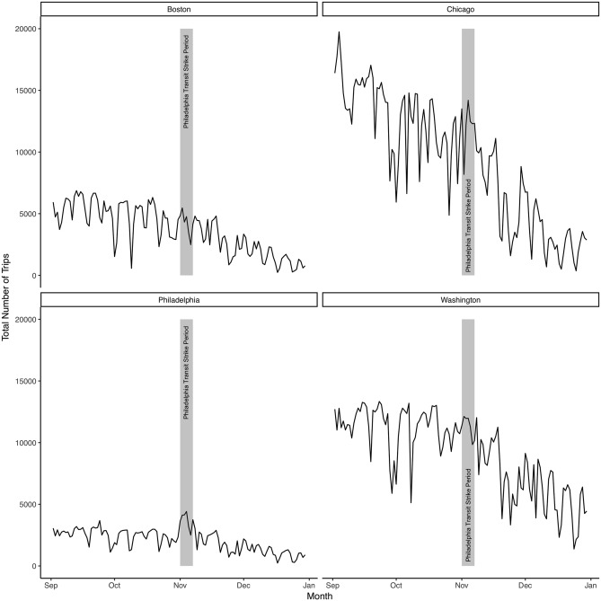
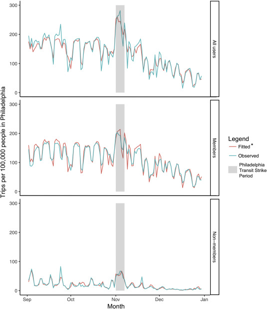

```{r setup, include=FALSE}
knitr::opts_chunk$set(echo = TRUE, fig.width = 6, echo=FALSE)

library(readr)
library(gt)
library(gtsummary)
library(lubridate)
library(modelr)
library(CausalImpact)
library(zoo)
library(huxtable)
library(rstanarm)
library(sjlabelled)
library(tidyverse)
library(mcp)
library(tidybayes)

memberData <- read_csv("member_data.csv") %>%
  mutate(by100000 = 10 * by10000) %>%
  dplyr::select(-by10000, -X1, -ID, -mean_duration) %>%
  mutate(start_time = mdy(start_time)) %>%
  add_row(city = "Philly", start_time = ymd("2016-01-23"), membertype = "shortterm") %>%
  add_row(city = "Philly", start_time = ymd("2016-01-23"), membertype = "member") %>%
  add_row(city = "Philly", start_time = ymd("2016-01-24"), membertype = "shortterm") %>%
  add_row(city = "Philly", start_time = ymd("2016-01-24"), membertype = "member") %>%
  add_row(city = "Philly", start_time = ymd("2016-01-25"), membertype = "shortterm") %>%
  add_row(city = "Philly", start_time = ymd("2016-01-26"), membertype = "shortterm") %>%
  add_row(city = "Washington", start_time = ymd("2016-01-23"), membertype = "shortterm") %>%
  add_row(city = "Washington", start_time = ymd("2016-01-23"), membertype = "member") %>%
  add_row(city = "Washington", start_time = ymd("2016-01-24"), membertype = "shortterm") %>%
  add_row(city = "Washington", start_time = ymd("2016-01-24"), membertype = "member") %>%
  add_row(city = "Washington", start_time = ymd("2016-01-25"), membertype = "shortterm") %>%
  add_row(city = "Washington", start_time = ymd("2016-01-25"), membertype = "member") %>%
  add_row(city = "Washington", start_time = ymd("2016-01-26"), membertype = "shortterm") %>%
  add_row(city = "Washington", start_time = ymd("2016-01-26"), membertype = "member") %>%
  group_by(start_time, city) %>%
  group_modify(~ add_row(.x, membertype = "all",
                         number_trips = sum(.x$number_trips),
                         by100000 = sum(.x$by100000), 
                         dummy = ifelse(sum(.x$dummy) == 2, 1, 0))) %>%
  group_by(city, membertype) %>%
  mutate(by100000_wmg = rollapply(by100000, width = 7, FUN = mean, na.rm = TRUE, by = 1, partial = TRUE, fill = NA)) %>%
  mutate(by100000 = ifelse(is.na(by100000), by100000_wmg, by100000)) %>%
  dplyr::select(-by100000_wmg) %>%
  ungroup()

phillyTemp <- read_csv("philly_temperature.csv") %>%
  mutate(DATE = ymd(DATE))
```

```{r repfig1}

fig1 <- memberData %>%
  filter(membertype == "all") %>%
  filter(start_time > "2016-09-01" & start_time < "2016-12-31") %>%
  ggplot(aes(start_time, number_trips)) +
  geom_line() +
  annotate("rect", xmin = ymd("2016-11-01"), xmax = ymd("2016-11-07"), 
                ymin = 0, ymax = 20000, alpha = 0.3) +
  facet_wrap(~city) + 
  labs(x = "Month",
       y = "Total Number of Trips",
       caption = "The shaded region is the Philadelphia 
       transit strike period 11/1 to 11/7.",
       title = "Bikeshare Trips in Four Cities",
       subtitle = "During the Period 9/1/16 to 12/31/16") +
  theme_classic() +
  theme(plot.caption = element_text(size = 12))
```

```{r repfig2}
# this is the solution the authors used
time <- 1:366
category <- factor(c(rep(1,305),rep(2,7),rep(3,54)))
time_strike <- c(rep(0,305),1:7,rep(0,54))
time_post <- c(rep(0,312),1:54)

allModel <- lm(filter(memberData, city == "Philly" & membertype == "all")$by100000 ~ phillyTemp$MEAN + phillyTemp$PRCP + filter(memberData, city == "Washington" & membertype == "all")$by100000 + filter(memberData, city == "Chicago" & membertype == "all")$by100000 + filter(memberData, city == "Boston" & membertype == "all")$by100000 + category + time + time_strike + time_post)

shortModel <- lm(filter(memberData, city == "Philly" & membertype == "shortterm")$by100000 ~ phillyTemp$MEAN + phillyTemp$PRCP + filter(memberData, city == "Washington" & membertype == "shortterm")$by100000 + filter(memberData, city == "Chicago" & membertype == "shortterm")$by100000 + filter(memberData, city == "Boston" & membertype == "shortterm")$by100000 + category + time + time_strike + time_post)

memModel <- lm(filter(memberData, city == "Philly" & membertype == "member")$by100000 ~ phillyTemp$MEAN + phillyTemp$PRCP + filter(memberData, city == "Washington" & membertype == "member")$by100000 + filter(memberData, city == "Chicago" & membertype == "member")$by100000 + filter(memberData, city == "Boston" & membertype == "member")$by100000 + category + time + time_strike + time_post)

allPreds <- memberData %>%
  filter(city == "Philly" & membertype == "all") %>%
  add_predictions(allModel) %>%
    remove_all_labels()

shortPreds <- memberData %>%
  filter(city == "Philly" & membertype == "shortterm") %>%
  add_predictions(shortModel) %>%
    remove_all_labels()

memPreds <- memberData %>%
  filter(city == "Philly" & membertype == "member") %>%
  add_predictions(memModel) %>%
    remove_all_labels()

finalData <- full_join(allPreds, full_join(memPreds, shortPreds, by = c("start_time", "city", "membertype", "number_trips", "dummy", "by100000", "pred")), by = c("start_time", "city", "membertype", "number_trips", "dummy", "by100000", "pred")) %>%
  mutate(membertype = dplyr::recode(membertype, 
                         'all' = "All Users",
                         'member' = "Members",
                         'shortterm' = "Non-Members")) %>%
  mutate(Observed = by100000) %>%
  mutate(Fitted = pred) %>%
  ungroup() %>%
  dplyr::select(start_time, Observed, Fitted, membertype) %>%
  gather(key = "Legend", value = "per100000", -start_time, -membertype)

fig2 <- finalData %>%
  filter(start_time > ymd("2016-09-01") & start_time < ymd("2016-12-31")) %>%
  ggplot(aes(x = start_time, y = per100000, color = Legend)) +
  geom_line() +
  annotate("rect", xmin = as.Date("2016-11-01", "%Y-%m-%d"), xmax = as.Date("2016-11-07", "%Y-%m-%d"), 
                ymin = 0, ymax = 300, alpha = 0.3) +
  facet_grid(membertype ~.) + 
  labs(x = "Month",
       y = "Trips per 100,000 people in Philadelphia",
       caption = "The shaded region is the Philadelphia 
       transit strike period 11/1 to 11/7.",
       title = "Modeling Bikeshare Trips in Philadelphia",
       subtitle = "During the period 9/1/16 to 12/31/16") +
  theme_classic() +
  theme(plot.caption = element_text(size = 12))
```

```{r CI}
pre_strike <- as.Date(c("2016-01-01", "2016-10-31"))
strike_period <- as.Date(c("2016-11-01", "2016-11-07"))
post_strike <- as.Date(c("2016-11-08", "2016-12-31"))

combinedData <- zoo(cbind(filter(memberData, city == "Philly" & membertype == "all")$by100000, phillyTemp$MEAN, phillyTemp$PRCP,filter(memberData, city == "Boston" & membertype == "all")$by100000,filter(memberData, city == "Washington" & membertype == "all")$by100000, filter(memberData, city == "Chicago" & membertype == "all")$by100000), as.Date(filter(memberData, city == "Philly" & membertype == "all")$start_time))


#Pre-Period: all pre-strike data, Post-period: strike week
strike_impact <- CausalImpact(data = combinedData, pre.period = pre_strike, post.period = strike_period, model.args = list(niter=5000, nseasons=7))
CI_plot <- plot(strike_impact, c("original", "pointwise")) +
  labs(title = "Bayesian Model",
       subtitle = "During the Period 9/1/16 to 12/31/16") +
  theme(plot.caption = element_text(size = 12))


#Pre-period: strike week, Post-period: all after strike data
post_strike_impact <- CausalImpact(data = combinedData, pre.period = strike_period, post.period = post_strike, model.args = list(niter=5000, nseasons=7))

```

```{r EXTmcp, include=FALSE}
# supressing output in this block because MCP always outputs log messages that can't be supressed

mcpData <- data.frame(cbind(filter(memberData, city == "Philly" & membertype == "all")$by100000, time))

model = list(
  V1 ~ time,
  V1 ~ 1 ~ time,
  V1 ~ 1 ~ time
)

prior = list(
  cp_1 = 305,
  cp_2 = 311
)

mcpFit <- mcp::mcp(model, prior = prior, data = mcpData)

mcpPlot <- plot(mcpFit) + 
  labs(title = "Multiple Change Point Model",
       subtitle = "During the Period 1/1/16 to 12/31/16 in Philadelphia",
       x = "Days in Time Series",
       y = "Rides/100k Population") +
  theme(plot.caption = element_text(size = 12))

```

```{r EXTstan, include=FALSE, warning=FALSE}
# huxtable throws a warning that I can't figure out how to get rid of
# so I'm supressing warnings here
cleanPhilly <- memberData %>%
  filter(city == "Philly" & membertype == "all") %>%
  mutate(time_period = ifelse(start_time < "2016-11-01", "Pre-Strike", ifelse(start_time > "2016-11-07", "Post-Strike", "Strike"))) %>%
  dplyr::select(-city, -dummy, - membertype)

cleanPhilly$time_period <- factor(cleanPhilly$time_period, levels = c("Post-Strike", "Strike", "Pre-Strike"))

cleanWeather <- phillyTemp %>%
  mutate(TEMP = MEAN) %>%
  dplyr::select(DATE, TEMP, PRCP)

stanData <- full_join(cleanPhilly, cleanWeather, by = c("start_time" = "DATE"))

stanModel <- stan_glm(data = stanData, by100000 ~ time_period + TEMP + PRCP, refresh = 0)

# remove "-" from coefficient names to eleminate huxtable error
names(stanModel$coefficients)[3] <- "time_periodPostStrike"
names(stanModel$ses)[3] <- "time_periodPostStrike"

stanTable <- huxreg("Model" = stanModel, 
       coefs = c("Daily Avg Temp" = "TEMP",
                "Daily Avg Rain" = "PRCP",
                "Strike Period" = 'time_periodStrike',
                "Post Strike Period" = 'time_periodPostStrike'),
       statistics = c('Total Observations' = 'nobs'),
       number_format = 2,
       ci_level = .95,
       error_format = '({conf.low} to {conf.high})')

observedGraph <- cleanPhilly %>%
  ggplot(aes(x = by100000, y = time_period, fill = time_period)) +
  stat_slabh() +
  labs(title = "Density of Ride Rate by Time Period",
       subtitle = "Periods Divided by Philadelphia Transit Strike",
       x = "Rides/100k Population",
       y = "",
       fill = "Time Period") +
  theme(plot.caption = element_text(size = 12))

newdata <- tibble(time_period = c("Pre-Strike", "Strike", "Post-Strike"), TEMP = c(50,50,50), PRCP = c(0,0,0))

preds <- data.frame(posterior_predict(stanModel, newdata = newdata)) %>%
  mutate("Pre-Strike" = X1) %>%
  mutate("Strike" = X2) %>%
  mutate("Post-Strike" = X3) %>%
  dplyr::select("Pre-Strike", "Strike", "Post-Strike") %>%
  pivot_longer(cols = everything(), names_to = "time_period", values_to = "by100000")

preds$time_period <- factor(preds$time_period, levels = c("Post-Strike", "Strike", "Pre-Strike"))

predGraph <- preds %>%
  ggplot(aes(x = by100000, y = time_period, fill = time_period)) +
  stat_slabh() +
  labs(title = "Predicted Density of Ride Rate by Time Period",
       subtitle = "Periods Divided by Philadelphia Transit Strike",
       x = "Rides/100k Population",
       y = "",
       fill = "Time Period") +
  theme(plot.caption = element_text(size = 12))

predAvgs <- preds %>%
  group_by(time_period) %>%
  dplyr::summarize(avg = mean(by100000))
```

# Abstract {-}

@FULLER2019 claimed that the disruption in public transit services caused by Philadelphia's transit workers strike from November 1-7th led to a short term increase in bikeshare use in Philadelphia when controlling for temperature, precipitation, and bikeshare use is similar cities during the same time. I successfully replicated Fuller's results. I recreated the interrupted time-series model that the authors used to model this natural experiment, and the Bayesian time-series model using the CausalImpact R package. I used the same raw data to with these structures to model bikeshare use per 100k population in Philadelphia. The models indicate that while the disruption to normal transit availability caused short term increase in bikehsare usage, usage returned to baseline within a short period. This may inform policy makers that short term interventions to promote cycling in cities may not have long term impacts.

\newpage

# Introduction {-}

My replication paper is **Impact of a public transit strike on public bicycle share use: An interrupted time series natural experiment study** by @FULLER2019. This paper was published in the June 2019 volume of the Journal of Transport & Health. The authors use Philadelphia's transit workers strike from November 1-7th, 2016, to generate a natural experiment in which other means of transit are interrupted to study the impact on bikeshare ride usage. The authors used two approaches to estimate the impact of the transit strike, interrupted time series and Bayesian structural time series models. The authors looked at control cities in Washington DC, Boston, and Chicago which are similar to Philadelphia in their size and in the development of their bikeshare infrastructure. They also attempted to control for the temperature and precipitation levels as variables that would also affect bikeshare ride usage. The study found that bikeshare usage went up in Philadelphia during this transit strike when other options were limited, but that after the strike bikeshare usage returned to the pre-strike baseline. The authors concluded that while interventions directed to incentive bikeshare usage would likely work given the flexibility shown by Philadelphia commuters, these interventions would need to be long term in order to change commuter's habits.

The authors originally used the R programming language. The data was publicly available on Harvard Dataverse. The authors made their code public on their Github^[https://github.com/walkabilly/Phillybikeshare]. I used R in my replication as well, and all of my analysis for this paper is available on my Github^[https://github.com/ddeuel/Bikeshare-Replication]. I was able to completely replicate both the interrupted time series and Bayesian structural time series models which were used by the original authors. The code was rewritten and the data cleaned in a different way but the same modeling methods were used. The same results were obtained for the key metrics the authors reported, which were the strike intercept and the post-strike slope for both models. Both of the figures that were published were replicated though with slightly different formatting on captions given that the original authors edited their figures outside of R while I stayed entirely within R.

I extended my replication by changing the handling of missing data, creating a multiple change point time series, creating a new linear model and making predictions using that model to analyze the differences in bikeshare use from the three main time periods of the study. I handled the missing data by imputing some missing daily values with the moving seven day averages from around that day. The multiple change point time series was generated using the R package MCP to break up the time series using change points on the start and end of the strike period. This analysis did not reveal any new discoveries in the data but provided for a unique visualization. The new linear model was created using the rstanarm R package, and I made predictions for the pre-strike, strike, and post-strike time periods by drawing from the posterior distribution of the model with standardized temperature and precipitation values. This revealed that when controlling for weather factors, the post-strike period had higher predicted bikeshare use which was unexpected and goes against the argument made by Fuller.

# Literature Review {-}

Given that bikeshare schemes are a relatively new phenomenon, there is not a long history of papers looking into their effects. @FULLER2013 written by the same group studied the impact of bikehshare programs on general cycling activity in Montreal and found that a public bicycle share program can lead to more people cycling. @BAUMAN studied the health consequences and rationale behind bikeshare schemes globally and concluded that more research is needed to better understand the potential health benefits. @JAPPINEN2013 concluded that the bikeshare scheme in Helsinki decreased public transit travel times on average by 10% when made available. The literature would seem to indicate positive impacts for public bikeshare schemes in promoting cycling in cities with possibly improved public health outcomes and reduced travel times.

@PUCHER2010 reviewed a number of international studies on the impact of interventions to promote cycling on behalf of cities. They found that almost all cities adopting comprehensive packages of interventions experienced large increases in bicycle use. @FULLER2012 another paper by the same authors used a similar time-series model to investigate two transit strikes in London and the resulting effect on bikeshare use in that case. That 2012 paper found an increase use of bikeshare programs during the strike, though the authors in that case did not attempt to draw any conclusions beyond the temporary increase in bikeshare use and did not study the post-strike effect on usage. @brodersen found the Bayesian structural time-series model to be useful in inferring causal impact which supports its use in this application.

# Paper Review {-}

The Southeastern Pennsylvania Transportation Authority is the public transit provider for Philadelphia and moves roughly 800,000 people per day. From November 1st to 7th the workers for this authority went on strike, disrupting city transit services for all of those who would normally use them. @FULLER2019 used this disruption as a natural experiment to see how this decrease supply of transportation would effect the use of the Philadelphia public bicycle share scheme. The data available give the membership type of the user which is divided between short-term rentals and members. The 30-day membership at the time of the study was \$15/month and allowed unlimited 60 minute rides. Short-term rentals, walk up users, at this time were charged \$4 per half hour. Similar public bikeshare schemes exist in many U.S cities. The authors chose to use data from the same time period from Chicago, Boston, and D.C. in order to control for changes in those similar large east coast cities. The authors also controlled for average daily temperature and precipitation data in Philadelphia during the time period since both of these factors are likely to also affect cycling rates. Weather data was taken from the National Climatic Data Center.

The first of two models used was an interrupted time series. This involved taking a linear regression with the number of bikeshare trips per 100k population as the outcome variable while controlling with the other factors. The strike intercept and post-strike slope were the two metrics of interest. The time series is split into three factors or categories, pre-strike, strike, and post-strike. This model was created for all bikeshare users, as well as for the member and short-term rental groups defined earlier. For all users the strike intercept showed an increase of 92 trips per 100k population, but the post-strike slope showed a decrease of 80 trips per 100k population.

The second model relied on the CausalImpact R package to generate a Bayesian structural time series model. This model used the same outcome variable of Philadelphia bikeshare trips per 100k population and controls of temperature, precipitation, and bikeshare usage in Boston, Chicago, and D.C. In this model the strike intercept was 86 trips per 100,000 population for all users, and the post-strike slope was 62 trips per 100,000. This led the authors to draw similar conclusions given similar statistics from both models.

The authors concluded based on this analysis that the public transit strike caused a short-term increase in bikeshare use in Philadelphia, but that this increase was temporary, and the bikeshare use returned to baseline quickly after the strike concluded. The authors hypothesized that ridership may not have been sustained after the strike due to users having a poor experience as a result of the high car traffic congestion during this same time. The authors also hypothesized that since the strike occurred in November as weather was turning colder in Philadelphia, new users may have been less likely to continue cycling than if the intervention had come in Spring or Summer. The authors also noted that the lack of data on individuals activity level meant that they were not able to draw any definitive conclusions on how this intervention may have impacted physical activity.

# Replication {-}

The first aspect of my replication was the graphic included in the original paper showing each city's bikeshare use in absolute terms across all membership types with a shaded region highlighting the time period during which the Philadelphia transit strike took place. The authors added some labels and elements of the legend outside of R in an image editor that I could not replicate exactly given that I decided to constrain all of my work to R, but the replication is still nearly exact, see the appendix replication.

In my replication of the interrupted time series model I decided to take a different approach to data cleaning and management than the authors did to reduce the number of data structures in use. I The original authors  The authors imported two csv files of raw data, but one was simply a sum by date of the membership type rows of the other and had mislabeled columns. I instead added a total user sum row for each date in the membership data. I used the same time categories as the authors to achieve the same model. The three categories were pre-strike, strike, and post-strike. Another time variable was creating as an integer value of days since January 1 in order to not use a date object as regression coefficient in the model. Standard base R *lm* command was used to generate the model with trips in Philadelphia per 100k population as the outcome variable. The paper included a figure visualizing this model with a fitted line showing the predicted value from the model for each date. The data is given for all users and for the division among short-term rentals and members. I took a different approach to cleaning the data again here and combined the predictions using the join functions from the dplyr package. Again the authors added some labels and elements of the legend outside of R in an image editor that I could not replicate exactly given that I decided to constrain all of my work to R, but I still replicated the graphic almost exactly, see the appendix replication.

I followed the essentially the same methods as the authors in creating the Bayesian structural time series model using the CausalImpact R package. This package does not allow for missing data in the covariates, unlike the previous model, so some value had to be estimated for the days with missing values. I dealt with the missing data in a similar manner to the authors by using the 7 day moving average as an estimate. We specify a date range as a pre-period and another as a post-period. In this case to get the strike-intercept the authors used all the data before the strike as the pre-period, and the 6 days of the strike as the post period. The authors did not publish any graphics of this model, but see Figure \@ref(fig:fig3) below for a visualization.

```{r fig3, fig.cap = "On the pointwise facet, movement from zero shows the deviation from the expected value without an intervention."}
print(CI_plot)
```

The authors then used another model of the pre-period as the strike period, and the post-period as all of the data following the strike period. I was able to confirm this was the method they used to achieve the values they published only through comparing the numbers, as they did not provide the code or program they used to create the table published in the paper. It seems most likely that they gathered the model data by hand for input into another program to generate the table.

# Extension {-}

There was missing data for Washington D.C. and Philadelphia from January 23-26. The authors in the interrupted time series model decided to input the date data for these missing points but leave everything else as *NA*. I tested imputed the missing data using the 7 week rolling average from around the missing data as an estimate. I found only very small changes in the two statistics of interest. The strike intercept changed to 92.8 from 92.5, and the post-strike slope changed to -80.3 from -80.5. This strengthens the authors findings, as the conclusions are unchanged even when missing data is treated differently.

I used the MCP R package to model multiple change points in the regression on the time series. This package uses Bayesian Inference, and I gave the model a prior with change points at day 305, 11/1, and day 311, 11/7, to model the time before, during, and after the transit strike. Using this model I couldn't control for other variables however, so the findings were not significant, though we have a good visualization of the data trends during these periods without controls. In Figure \@ref(fig:fig4) see that the data follows an upward trend throughout the year until our first change point where we have a large spike, then a downward trend for the remainder of the year. This tells us that we would see this downward trend regardless of controls, and hints to the seasonality of bikeshare usage and its relationship with the outside temperature.


```{r fig4, fig.cap = "Changepoints are day 305 and 311, the beginning and end of the transit strike"}
print(mcpPlot)
```

I wanted to investigate the differences in bikeshare usage rates between the three distinct time periods more closely. The CausalImpact method used by the authors showed that the Post-Strike slope had an enormous confidence interval in that model, ranging from -265 to 161. When I replicated these findings I got the same number, and the package warned in its detailed output that the finding may be spurious. We can look closely at the observed data for Philadelphia for these time periods in Figure \@ref(fig:fig5) below.


```{r fig5, fig.cap = "The Pre-Strike and Post-Strike periods have significantly lower bikeshare use rates than the strike period."}
print(observedGraph)
```


This data is for all member types, member and short-term rental. The graph displays the density of the number of rides per 100,000 population in Philadelphia fore each day during these three time periods. Clearly the bikeshare use during the strike period was much higher than the other two, but it is unclear what comparisons could be drawn from the pre-strike and post-strike time periods. 

The authors noted in their conclusion that there is a strong seasonal effect at play with the this data which makes generalizing the findings problematic. As we saw in the time series change point analysis, there is already a strong trend in the data according to the seasons. In order to investigate this relationship further I created a new model using the rstanarm R package. I simplified this model somewhat from the original linear model, but the key statistics were roughly the same with a strike intercept of 130.08, and a post strike slope of -112.26. Fuller defined the strike intercept to be the coefficient associated with the strike period factor, and the post-strike slope to be the strike intercept minus the post-strike period factor coefficient. This reasoning was not explained in the paper, but I will defer to authors decision in this case on how to define those metrics. See the table below for the full model statistics.

```{r table1}
stanTable
```

The coefficient on average daily temperature tells us that for a one degree Fahrenheit increase in average daily temperature we would expect to see a 2.5 ride/100k population increase in the model. Similarly the coefficient of -12 for the average daily precipitation tells us that a 1 inch increase in daily precipitation is modeled by a -12 decrease in rideshare use rate. The intercept in this context has little real meaning given that it is negative, but it would be the expected bikeshare use rate for a temperature of 0 and precipitation of 0 during the pre-strike period.

We can use the posterior distribution generated by this model to predict a distribution of values for a standardized scenario @king. I decided to make predictions for each of the three crucial time periods: pre-strike, strike, and post-strike. These predictions were standardized to 50 degree mean daily temperature and 0 inches of precipitation. I found that controlling for precipitation and temperature gave the mean of 4000 draws for the post-strike period a higher predicted bikeshare use rate than the pre-strike period. The mean predicted bikeshare rides per 100,000 population were 107.6 for the post-strike period and 90.2 for the pre-strike period. The strike period was much higher at 219.2 rides/100k people, as we would expect. Figure \@ref(fig:fig6) below shows a visualization of the distributions on the predictions made.

```{r fig6, fig.cap = "These predictions are generated from the posterior distribution fora standardized precipitation of 0 inches and temperatureof 50 degrees. Again the Pre-Strike and Post-Strike periodshave significantly lower bikeshare use rates than the strike periodthough now standardized, the Post-Strike period appears to have higherpredicted bikeshare usage rates.",x = "Rides/100k Population"}
print(predGraph)
```

I found these predictions to be a compelling representation of the observed phenomenon. Given that the post-strike period had a higher predicted bikeshare use than the pre-strike period, that somewhat weakens the claim that the strike had very little effect on the habits after normal transit services were resumed. More research in this area is needed, and a similar study occurring in Spring where seasonal trends would promote continued bikeshare use may different results.


\newpage


# References {-}

<div id="refs"></div>

\newpage

# Appendix {-}

Figure from original paper:

{#id .class width=75% height=75%}

\pagebreak

My replication:

```{r fig1}
print(fig1)
```


\pagebreak

Figure from original paper:

{#id .class width=75% height=75%}

\pagebreak

My replication:

```{r fig2}
print(fig2)
```
